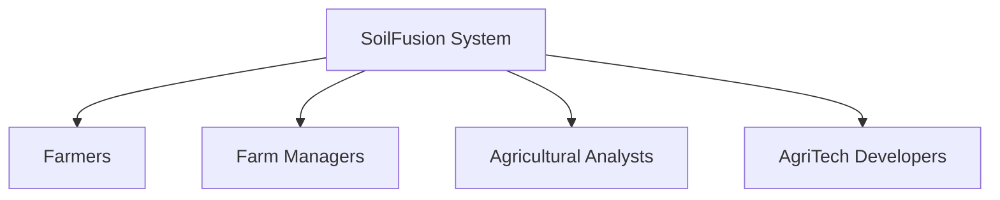
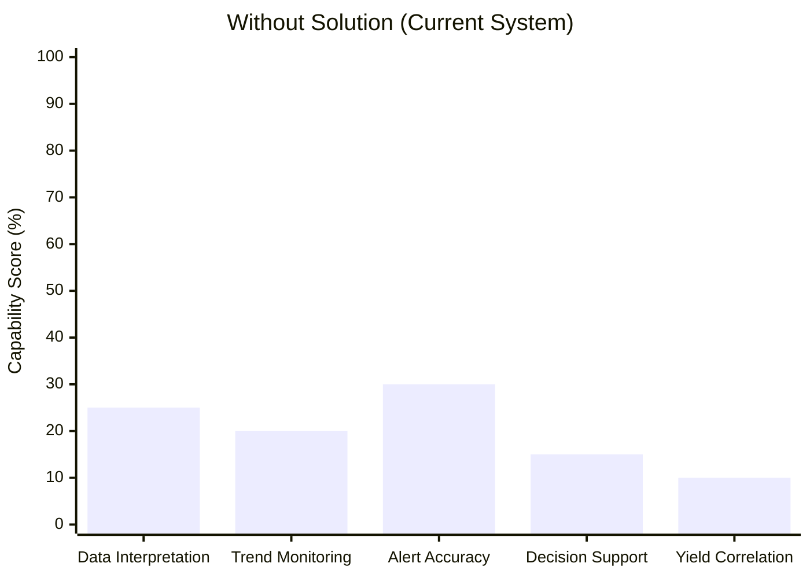
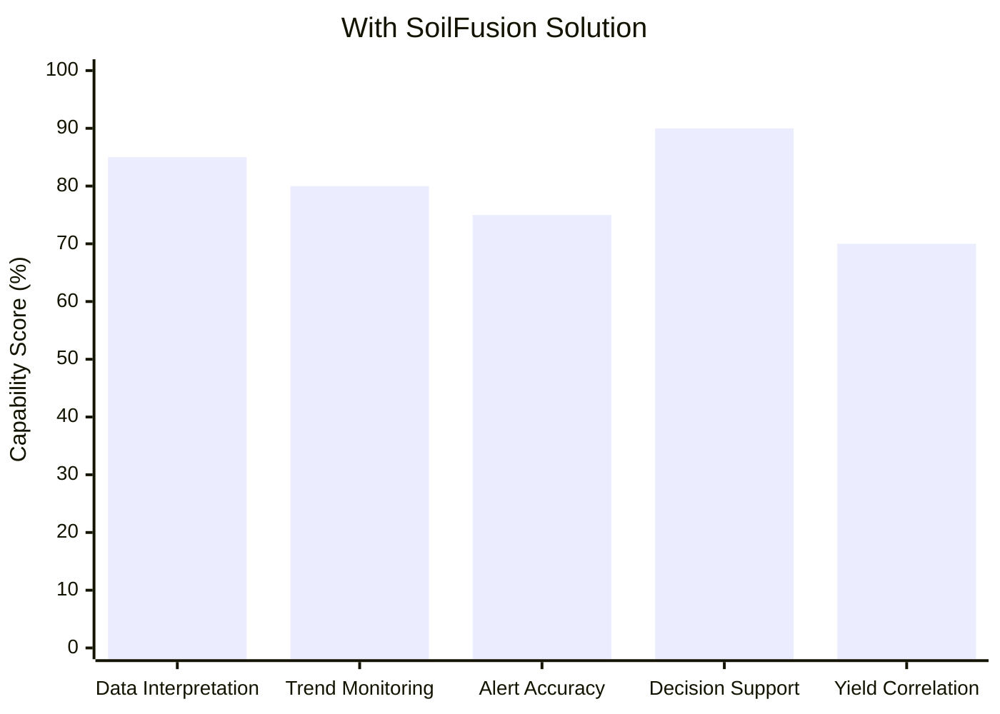
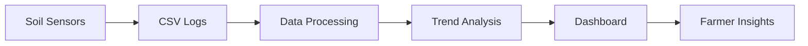

# Project Title

SoilFusion: Intelligent Soil Health Dashboard from Sensor Logs

---

## 1. Problem Statement

### Problem Title

Soil Health Dashboard from Sensor Logs

Problem Description
Modern farms increasingly use IoT sensors to monitor soil parameters such as moisture, pH, nitrogen levels, and temperature. These sensors continuously generate large volumes of data, typically stored as raw CSV logs. While this data is abundant, it often lacks meaningful interpretation, creating an intelligence gap between data collection and real agricultural decisions.
Farmers are surrounded by numbers but lack the tools to convert those numbers into clear, actionable insights about soil health, irrigation timing, and planting decisions.

| Challenge                                   | Description                                                                                      | Impact on Farmers                                                                    |
| ------------------------------------------- | ------------------------------------------------------------------------------------------------ | ------------------------------------------------------------------------------------ |
| **Raw Data Liability ("So What?" Problem)** | A sensor reading such as **Moisture: 15.2%** is just a number without context or interpretation. | Farmers cannot easily determine whether irrigation should happen now or later.       |
| **Human Interpretation Burden**             | Raw sensor logs require manual analysis to understand soil conditions.                           | Farmers must spend time interpreting data instead of focusing on farming activities. |
| **Snapshot vs Story Problem**               | Most tools only show the current soil reading instead of long-term soil trends.                  | Slow soil degradation or nutrient depletion may go unnoticed.                        |
| **Missing Historical Correlation**          | Current systems rarely correlate live soil conditions with historical crop yield data.           | Farmers cannot learn from past harvest outcomes to improve future decisions.         |
| **Alert Fatigue ("Cry Wolf" Problem)**      | Sensors operating in harsh environments may produce temporary spikes or noise in readings.       | Frequent false alerts reduce trust in the monitoring system.                         |
| **Decision Paralysis**                      | Farming decisions such as planting or irrigation depend heavily on correct timing.               | Without clear insights, farmers rely on intuition instead of data-driven decisions.  |

  ## Current Situation v/s Desired Outcome

| Current Situation                     | Desired Outcome                                          |
| ------------------------------------- | -------------------------------------------------------- |
| Raw sensor logs stored as CSV files   | Intelligent dashboards that visualize soil health trends |
| Farmers manually interpret numbers    | Automated insights and recommendations                   |
| Alerts triggered by simple thresholds | Smart alerts that filter noise and detect real risks     |
| Short-term data snapshots             | Long-term soil health analysis and predictions           |

-----

## Target Users

| Category                                 | Details                                                                         |
| ---------------------------------------- | ------------------------------------------------------------------------------- |
| **Geographical Focus**                   | India 🇮🇳                                                                      |
| **Estimated Farmers Using Soil Sensors** | ~30,00,000 (30 Lakh)                                                            |
| **Type of Data Generated**               | Time-series soil data (pH, Moisture, Nitrogen, Temperature)                     |
| **Current Market Gap**                   | Raw sensor data lacks structured visualization, correlation, and interpretation |
| **Opportunity Identified**               | Development of a Soil Health Intelligence & Analytics Platform                  |

| User Segment               | Description                                            | Key Needs                                                   |
| -------------------------- | ------------------------------------------------------ | ----------------------------------------------------------- |
| **Sensor-Enabled Farmers** | Farmers already collecting soil data using IoT sensors | Actionable insights, early alerts, planting recommendations |
| **Data Format**            | CSV-based sensor logs (time-series data)               | Visualization dashboards & parameter correlation            |
| **Primary Goal**           | Maintain optimal soil health for maximum yield         | Data-driven decision-making                                 |

| Parameter                | Description                                                                                |
| ------------------------ | ------------------------------------------------------------------------------------------ |
| **Initial Target Users** | 3,000 Farmers                                                                              |
| **Purpose**              | Pilot deployment & product validation                                                      |
| **Key Objectives**       | Improve threshold detection, reduce false positives, refine planting recommendation models |
| **Expected Outcome**     | Achieve Product–Market Fit & real-world validation                                         |

  ### Existing Gaps

## Existing Gap vs SoilFusion Improvement

  

| # | Limitation in Existing Systems                   | Impact on Farmers                             |
| - | ------------------------------------------------ | --------------------------------------------- |
| 1 | Data collected but not effectively visualized    | Farmers cannot interpret trends easily        |
| 2 | No proper correlation with historical yield data | Poor understanding of long-term soil behavior |
| 3 | No advisory or predictive insights               | No guidance for planting or soil optimization |
| 4 | No intelligent alerts                            | Delayed reaction to soil degradation          |
| 5 | Raw logs without interpretation                  | Reduced practical usability                   |

## System Workflow

---

## 2. Problem Understanding & Approach

### Root Cause Analysis
### Solution Strategy

---

## 3. Proposed Solution

### Solution Overview
### Core Idea
### Key Features

---

## 4. System Architecture

### High-Level Flow
User → Frontend → Backend → Model → Database → Response

### Architecture Description

### Architecture Diagram
(Add system architecture diagram image here)

---

## 5. Database Design

### ER Diagram
(Add ER diagram image here)

### ER Diagram Description

---

## 6. Dataset Selected

### Dataset Name
### Source
### Data Type
### Selection Reason
### Preprocessing Steps

---

## 7. Model Selected

### Model Name
### Selection Reasoning
### Alternatives Considered
### Evaluation Metrics

---

## 8. Technology Stack

### Frontend
### Backend
### ML/AI
### Database
### Deployment

---

## 9. API Documentation & Testing

### API Endpoints List
- Endpoint 1:
- Endpoint 2:
- Endpoint 3:

### API Testing Screenshots
(Add Postman / Thunder Client screenshots here)

---

## 10. Module-wise Development & Deliverables

### Checkpoint 1: Research & Planning
- Deliverables:

### Checkpoint 2: Backend Development
- Deliverables:

### Checkpoint 3: Frontend Development
- Deliverables:

### Checkpoint 4: Model Training
- Deliverables:

### Checkpoint 5: Model Integration
- Deliverables:

### Checkpoint 6: Deployment
- Deliverables:

---

## 11. End-to-End Workflow

1.
2.
3.
4.
5.
6.
7.

---

## 12. Demo & Video

- Live Demo Link:
- Demo Video Link:
- GitHub Repository:

---

## 13. Hackathon Deliverables Summary

-
-
-
-

---

## 14. Team Roles & Responsibilities

| Member Name | Role | Responsibilities |
|-------------|------|-----------------|

---

## 15. Future Scope & Scalability

### Short-Term
-

### Long-Term
-

---

## 16. Known Limitations

-
-
-

---

## 17. Impact

-
-
-
