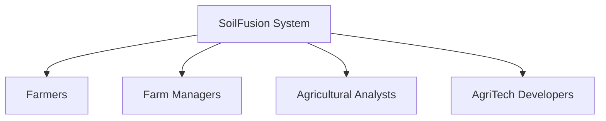
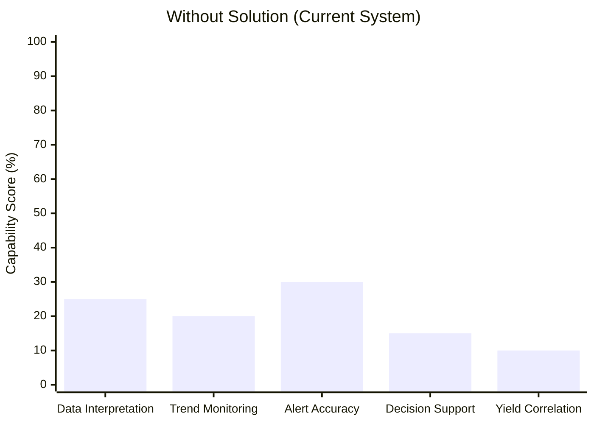
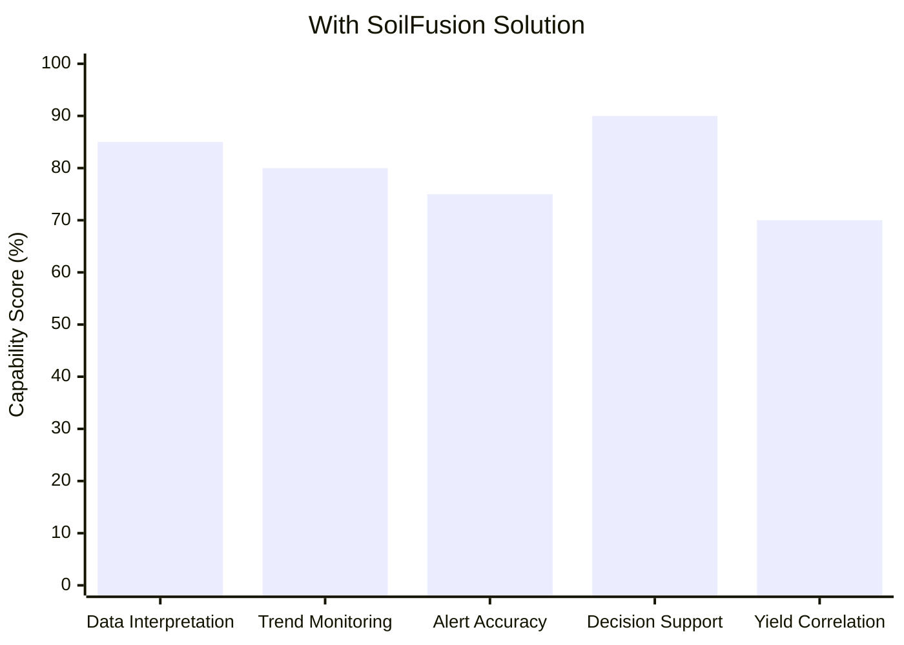
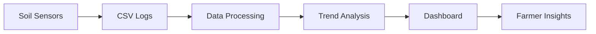
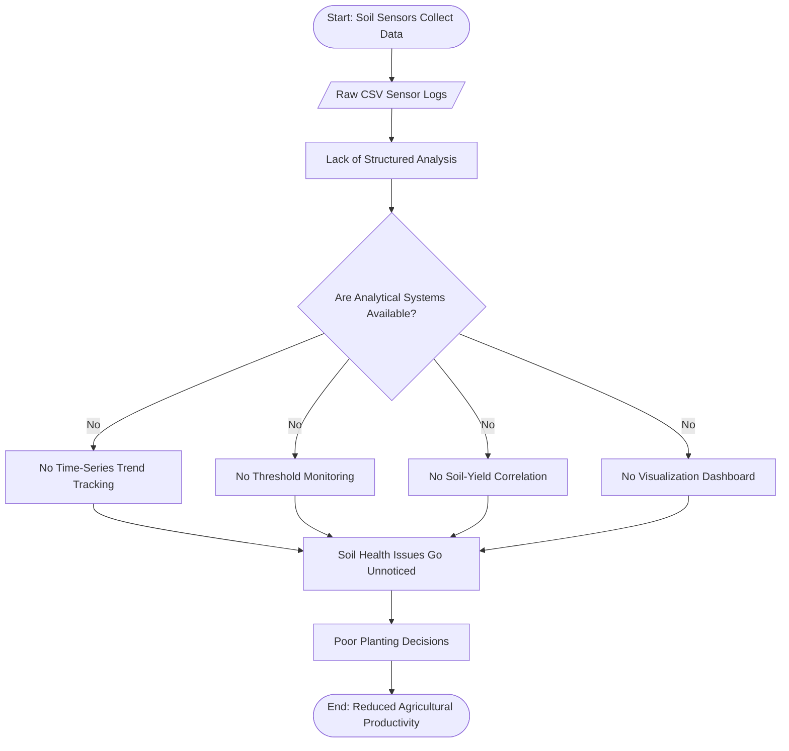
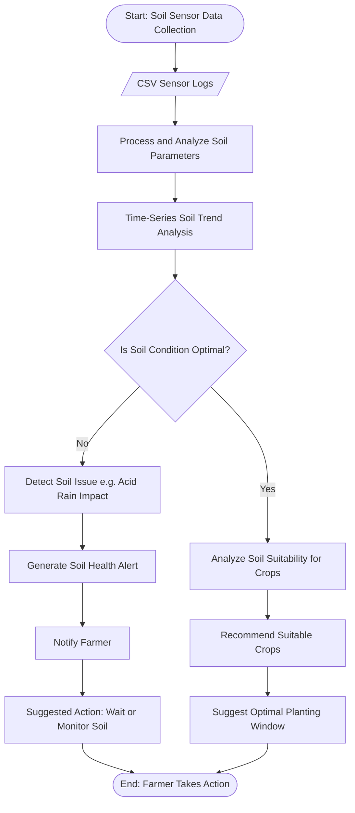
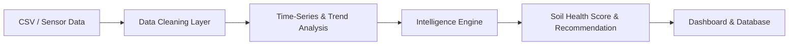
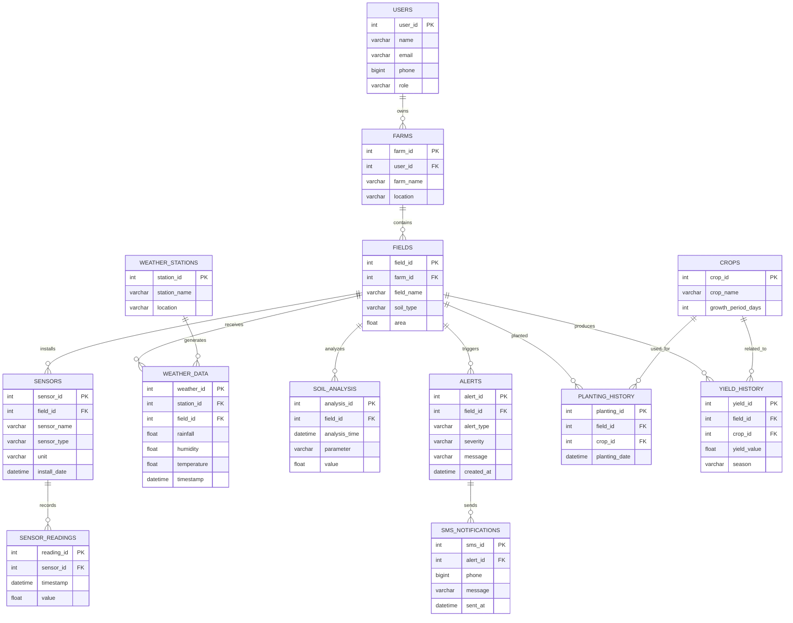

# Project Title

SoilFusion: Intelligent Soil Health Dashboard from Sensor Logs

---

## 1. Problem Statement

### Problem Title

Soil Health Dashboard from Sensor Logs

Problem Description
Modern farms increasingly use IoT sensors to monitor soil parameters such as moisture, pH, nitrogen levels, and temperature. These sensors continuously generate large volumes of data, typically stored as raw CSV logs. While this data is abundant, it often lacks meaningful interpretation, creating an intelligence gap between data collection and real agricultural decisions.
Farmers are surrounded by numbers but lack the tools to convert those numbers into clear, actionable insights about soil health, irrigation timing, and planting decisions.

| Challenge                                   | Description                                                                                      | Impact on Farmers                                                                    |
| ------------------------------------------- | ------------------------------------------------------------------------------------------------ | ------------------------------------------------------------------------------------ |
| **Raw Data Liability ("So What?" Problem)** | A sensor reading such as **Moisture: 15.2%** is just a number without context or interpretation. | Farmers cannot easily determine whether irrigation should happen now or later.       |
| **Human Interpretation Burden**             | Raw sensor logs require manual analysis to understand soil conditions.                           | Farmers must spend time interpreting data instead of focusing on farming activities. |
| **Snapshot vs Story Problem**               | Most tools only show the current soil reading instead of long-term soil trends.                  | Slow soil degradation or nutrient depletion may go unnoticed.                        |
| **Missing Historical Correlation**          | Current systems rarely correlate live soil conditions with historical crop yield data.           | Farmers cannot learn from past harvest outcomes to improve future decisions.         |
| **Alert Fatigue ("Cry Wolf" Problem)**      | Sensors operating in harsh environments may produce temporary spikes or noise in readings.       | Frequent false alerts reduce trust in the monitoring system.                         |
| **Decision Paralysis**                      | Farming decisions such as planting or irrigation depend heavily on correct timing.               | Without clear insights, farmers rely on intuition instead of data-driven decisions.  |

  ## Current Situation v/s Desired Outcome

| Current Situation                     | Desired Outcome                                          |
| ------------------------------------- | -------------------------------------------------------- |
| Raw sensor logs stored as CSV files   | Intelligent dashboards that visualize soil health trends |
| Farmers manually interpret numbers    | Automated insights and recommendations                   |
| Alerts triggered by simple thresholds | Smart alerts that filter noise and detect real risks     |
| Short-term data snapshots             | Long-term soil health analysis and predictions           |

-----

## Target Users

| Category                                 | Details                                                                                                                                                                                                                              |
| ---------------------------------------- | ------------------------------------------------------------------------------------------------------------------------------------------------------------------------------------------------------------------------------------ |
| **Geographical Focus**                   | India 🇮🇳                                                                                                                                                                                                                           |
| **Estimated Farmers Using Soil Sensors** | ~30,00,000 (30 Lakh) active users (estimated adoption across medium & large farms)                                                                                                                                                   |
| **Type of Data Generated**               | Time-series soil data collected at 15–60 min intervals:  • pH (range: 4.5 – 9.0)  • Moisture (% volumetric water content: 5% – 60%)  • Nitrogen (ppm: 0 – 2000 ppm depending on soil type)  • Temperature (°C: 5 – 50°C) |
| **Current Market Gap**                   | • 70–80% sensor users rely on raw CSV exports  • No automated multi-parameter correlation  • Static threshold alerts (no adaptive intelligence)                                                                                |
| **Opportunity Identified**               | Development of a Soil Health Intelligence & Analytics Platform targeting early-stage precision agriculture adoption (initial 3,000 pilot users)                                                                                      |

| User Segment               | Description                                                                                  | Key Needs                                                                                                       |
| -------------------------- | -------------------------------------------------------------------------------------------- | --------------------------------------------------------------------------------------------------------------- |
| **Sensor-Enabled Farmers** | Farmers already collecting soil data using IoT sensors (avg 2–10 sensors per farm)           | • Actionable insights within 24 hours  • <10% false alert rate  • Data-backed planting window suggestions |
| **Data Format**            | CSV-based sensor logs (time-series data, typically 5,000–50,000 rows per season)             | • Automated trend visualization  • Multi-parameter correlation matrix  • Exportable reports (PDF/CSV)     |
| **Primary Goal**           | Maintain optimal soil health to improve yield efficiency by 5–15% (target improvement range) | • Data-driven irrigation scheduling  • Nutrient optimization planning                                        |

| Parameter                | Description                                                                                                                                                                                             |
| ------------------------ | ------------------------------------------------------------------------------------------------------------------------------------------------------------------------------------------------------- |
| **Initial Target Users** | 3,000 Farmers (Pilot Phase – Year 1)                                                                                                                                                                    |
| **Purpose**              | • Validate model accuracy (target R² > 0.75 for yield prediction)  • Reduce false alerts by 30–40% compared to static threshold systems                                                              |
| **Key Objectives**       | • Adaptive threshold detection using rolling averages (7–14 day window)  • Correlate soil parameters with past 3–5 crop cycles  • Generate planting recommendation confidence score (0–100 scale) |
| **Expected Outcome**     | Achieve Product–Market Fit with ≥70% monthly active usage among pilot farmers and measurable improvement in decision timing                                                                             |

------

## Existing Gap vs SoilFusion Improvement

  

| Limitation in Existing Systems                       | Impact on Farmers (with Practical Metrics)                                                                                                                       |
| ---------------------------------------------------- | ---------------------------------------------------------------------------------------------------------------------------------------------------------------- |
| **Data collected but not effectively visualized**    | • 60–75% of IoT agri users rely on raw CSV/manual export analysis (industry estimate)   • 4–8 hrs/week spent reviewing sensor logs manually                   |
| **No proper correlation with historical yield data** | • <20% of small–mid farms use structured yield analytics tools   • Yield variance of 10–25% remains unexplained due to lack of historical modeling            |
| **No advisory or predictive insights**               | • Less than 15% of Indian farms use predictive analytics (precision agri reports)   • Planting timing errors can reduce yield by 5–15% depending on crop type |
| **No intelligent alerts**                            | • Static threshold systems generate 30–50% false positives (IoT field studies range)   • Alert fatigue reduces farmer response rate over time                 |
| **Raw logs without interpretation**                  | • Sensor systems generate 5,000–50,000 data points per season per farm   • >70% of collected data remains underutilized without analytics layer               |

## System Workflow

---

## 2. Problem Understanding & Approach

### Root Cause Analysis

| Problem Area             | Root Cause                                                       | Impact on Farmers                                                   |
| ------------------------ | ---------------------------------------------------------------- | ------------------------------------------------------------------- |
| Raw Sensor Logs          | Soil sensors generate raw CSV logs without structured processing | Farmers cannot easily interpret soil conditions                     |
| Lack of Trend Tracking   | No time-series analysis of soil parameters                       | Long-term soil degradation goes unnoticed                           |
| No Threshold Detection   | Absence of defined parameter limits for alerts                   | Critical soil conditions are detected too late                      |
| No Parameter Correlation | Soil parameters are not correlated with historical yield         | Farmers cannot understand which soil conditions affect productivity |
| Poor Data Visualization  | Raw data is difficult to interpret without dashboards            | Decision making becomes slow and reactive                           |

### Solution Strategy

1) Ingest Soil Sensor Data
Process soil sensor logs stored in CSV format.

3) Analyze Soil Parameters
Perform time series analysis on parameters such as pH, moisture, nitrogen levels, and temperature to monitor soil health trends.

5) Detect Abnormal Soil Conditions
Identify threshold breaches or sudden changes in soil parameters that may indicate issues such as acid rain impact or nutrient imbalance.

7) Generate Farmer Alerts
Notify farmers when soil conditions become unfavorable and recommend temporary actions such as delaying planting.

9) Recommend Suitable Crops
If soil conditions are within optimal ranges, suggest suitable crops and planting windows using soil parameter analysis and historical yield data.

---

## 3. Proposed Solution

1) Alerts for problems

If something goes wrong (e.g., pH drops suddenly, moisture too low, nitrogen low), the system sends instant alerts like:
"Soil is getting too acidic wait a few days or add lime before planting."

3) Smart suggestions when soil is good
   
When everything is in the healthy range, it checks soil and past yield data and recommends:
Best crops to plant right now (e.g., moong, wheat, tomato, okra)
Good planting window (e.g., "Next 7 to 10 days look perfect start sowing")

| Component               | Function                                       | Benefit                                  |
| ----------------------- | ---------------------------------------------- | ---------------------------------------- |
| CSV Data Ingestion      | Reads soil sensor logs                         | Converts raw data into structured format |
| Time-Series Analysis    | Tracks soil parameter trends                   | Detects long-term soil health changes    |
| Threshold Monitoring    | Detects abnormal soil conditions               | Enables early warning alerts             |
| Event Detection         | Identifies events like acid rain impact        | Explains cause of soil imbalance         |
| Soil–Yield Correlation  | Compares soil conditions with historical yield | Improves crop recommendations            |
| Recommendation Engine   | Suggests suitable crops when soil is healthy   | Guides planting decisions                |
| Alert System            | Sends alerts when soil conditions are unsafe   | Prevents poor planting decisions         |
| Visualization Dashboard | Displays soil health trends                    | Makes insights easy to understand        |

### Key Features

1) Real-time soil health monitoring

2) Early alerts for abnormal soil conditions

3) Detection of environmental impacts (e.g., acid rain)

4) Visualization of soil health trends

5) Data-driven crop recommendations

6) Actionable insights for farmers

---

## 4. System Architecture

### High-Level Flow

### Architecture Description
🌱 SoilFusion – Workflow Description

.) The farmer registers, creates farms, and divides them into fields.

.) Sensors are installed in each field to continuously collect soil data.

.) Sensor readings are stored as CSV logs and processed by the system.

.) The system analyzes key soil parameters and combines them with weather data.

.) Soil trends are generated to understand overall field health.

.) If abnormal conditions are detected, an alert is created and an SMS is sent to the farmer.

.) If soil conditions are healthy, the system recommends suitable crops and the best planting window.

.) Planting history and yield data are recorded to track crop performance.

.) All insights, trends, and recommendations are shown on the dashboard.

.) The farmer uses this information to make informed, data-driven decisions.
### Architecture Flow

```mermaid
flowchart LR

A[Farmer Registers Account] --> B[Farmer Creates Farm and Fields]

B --> C[Sensors Installed in Fields]

C --> D[Sensors Generate Soil Data]

D --> E[Sensor Readings Stored as CSV Logs]

E --> F[System Processes and Structures Data]

F --> G[Analyze Soil Parameters<br/>Moisture pH Nitrogen Temperature]

G --> H[Weather Station Provides Weather Data<br/>Rainfall Humidity Temperature]

H --> I[Combine Sensor Data and Weather Data]

I --> J[Generate Soil Analysis and Trends]

J --> K{Abnormal Soil Condition Detected}

K -->|Yes| L[Generate Alert<br/>Low Moisture High Temperature Nutrient Deficiency]

L --> M[Send SMS Notification to Farmer]

K -->|No| N[Soil Conditions Healthy]

N --> O[Recommend Suitable Crops<br/>Suggest Optimal Planting Window]

O --> P[Record Planting History]

P --> Q[Analyze Yield History for Crop Performance]

M --> R[Update Dashboard with Insights]
Q --> R

R --> S[Display Soil Health Trends Reports and Recommendations]

S --> T[Farmer Takes Data Driven Decision]

%% styles
classDef process fill:#56CCF2,stroke:#2F80ED,stroke-width:2px,color:#000;
classDef decision fill:#BB6BD9,stroke:#8E44AD,stroke-width:2px,color:#fff;
classDef alert fill:#FF6B6B,stroke:#C0392B,stroke-width:2px,color:#fff;
classDef healthy fill:#27AE60,stroke:#1E8449,stroke-width:2px,color:#fff;
classDef final fill:#F2C94C,stroke:#B7950B,stroke-width:2px,color:#000;

class C,D,E,F,G,H,I,J,R,S process;
class K decision;
class L,M alert;
class N,O healthy;
class T final;
```

---

## 5. Database Design

## ER Diagram

### ER Diagram Description

The ER diagram illustrates the database structure of the SoilFusion Soil Monitoring System, which manages farms, fields, sensors, and agricultural data to monitor soil health and support better farming decisions.
The system starts with Users, who represent farmers or administrators using the platform. Each user can manage multiple Farms, and every farm can contain several Fields where crops are grown.

Each field can have multiple Sensors installed to monitor soil parameters such as moisture, pH, nitrogen, and temperature. These sensors continuously generate Sensor Readings, which store time series data collected from the field.

The system also collects environmental information through Weather Stations and Weather Data, which helps understand how weather conditions affect soil health.
Using the collected sensor data, the system performs Soil Analysis to identify patterns and trends in soil conditions. When abnormal conditions are detected, the system generates Alerts, which can trigger SMS Notifications to inform farmers directly on their phone.

Additionally, the system keeps track of Crops, Planting History, and Yield History. This allows the platform to analyze how soil conditions impact crop productivity over time.
Overall, the ER diagram shows how the system connects sensor data, environmental factors, and farming activities to transform raw soil readings into meaningful agricultural insights.

---

## 6. Dataset Selected

### Dataset Name
### Source
### Data Type
### Selection Reason
### Preprocessing Steps

---

## 7. Model Selected

### Model Name
### Selection Reasoning
### Alternatives Considered
### Evaluation Metrics

---

## 8. Technology Stack

### Frontend
### Backend
### ML/AI
### Database
### Deployment

---

## 9. API Documentation & Testing

### API Endpoints List
- Endpoint 1:
- Endpoint 2:
- Endpoint 3:

### API Testing Screenshots
(Add Postman / Thunder Client screenshots here)

---

## 10. Module-wise Development & Deliverables

### Checkpoint 1: Research & Planning
- Deliverables:

### Checkpoint 2: Backend Development
- Deliverables:

### Checkpoint 3: Frontend Development
- Deliverables:

### Checkpoint 4: Model Training
- Deliverables:

### Checkpoint 5: Model Integration
- Deliverables:

### Checkpoint 6: Deployment
- Deliverables:

---

## 11. End-to-End Workflow

1.
2.
3.
4.
5.
6.
7.

---

## 12. Demo & Video

- Live Demo Link:
- Demo Video Link:
- GitHub Repository:

---

## 13. Hackathon Deliverables Summary

-
-
-
-

---

## 14. Team Roles & Responsibilities

## 14. Team Roles & Responsibilities

| Member Name | Role | Responsibilities |
|-------------|------|------------------|
| Anubhav Gupta | Team Leader & Frontend Developer | Coordinated the team and worked on frontend development. Designed the dashboard interface,and helped integrate the frontend with backend APIs. |
| Surya Narayan | Data Researcher | Researched soil sensor datasets and agricultural parameters such as moisture, pH, nitrogen, and temperature. Helped the team understand the data and supported logic design for analysis. |
| Deeptanu Bhunia | AI/ML & Backend Developer | Worked on backend development and AI/ML related components. Implemented data processing logic, helped build the analysis pipeline for soil data, and assisted with backend APIs and database integration. |

---

## 15. Future Scope & Scalability

### Short-Term
- Integrate real-time IoT sensors to automatically collect soil data instead of manual CSV uploads.
- Improve data visualization with advanced dashboards and interactive soil health reports.
- Implement more accurate alert thresholds for parameters like moisture, pH, and nitrogen levels.
- Add weather API integration to enhance soil condition analysis and predictions.

### Long-Term
- Apply machine learning models to predict crop yield and optimal planting schedules.
- Build a mobile application for farmers to receive alerts and insights in real time.
- Integrate satellite and remote sensing data for large-scale soil monitoring.
- Expand the system to support smart irrigation recommendations and automated farm management.

## 16. Known Limitations

- The current system relies on uploaded CSV sensor logs rather than real-time IoT sensor streaming.
- Soil analysis accuracy depends on the quality and completeness of the available dataset.
- Weather data integration is limited and may not fully represent micro climate variations across different fields.
- Crop recommendation logic is currently rule based and may require machine learning models for higher accuracy.
- Large-scale deployments may require optimized data pipelines and cloud infrastructure for handling high frequency sensor data.

---

## 17. Impact

- Helps farmers understand soil health trends instead of relying only on raw sensor readings.
- Enables early detection of soil issues such as low moisture or nutrient imbalance through smart alerts.
- Supports data driven farming decisions for irrigation, planting, and soil treatment.
- Improves long term soil sustainability by monitoring soil conditions over time.
- Reduces productivity loss by providing actionable insights from soil sensor data.
